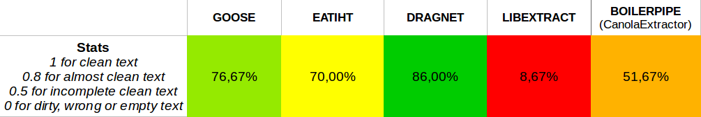

# HTMLContentExtraction

Benchmarks the most common open-source HTML content extractors : Goose, eatiht, Dragnet, libextract & BoilerPipe

## Get started

### Prerequisites

Developed in Python 2.7

Install the requirements.txt :

```bash
pip install requirements.txt
```
Place your HTML files into *./data/htmlfiles*, or generate them from urls with **HTMLextract.py** (best is to use a urls.csv file in *./data* with 2 columns: file ID | URL)

### How to use

- **HTMLextract.py** allows to generate a HTML file for each URL specified in *./data/urls.csv*.

- **benchmark.py** prints the result of the content extraction with each method, from a random HTML file in *./data/htmlfiles/*.
Results & stats for each method can be found in **[benchmarkStats.ods](./benchmarkStats.ods)** (benchmark done on a corpus of press & blog articles).


- **contentextraction.py** allows to generate a text file for each HTML file stored in *./data/htmlfiles/*, using the best method (currently Dragnet).


